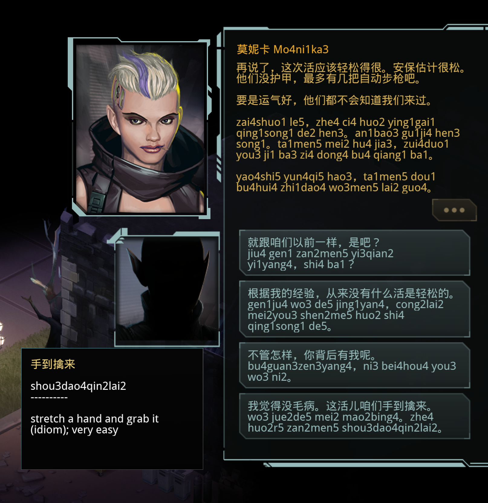

# Video game language learning mods

A collection of game mods that add language-learning support. Each mod hooks into a game's text rendering to enable per-word interaction, hover detection, and dictionary lookup — turning gameplay into immersive reading practice.

## Games

| Game | Mod | Status |
|------|-----|--------|
| [Shadowrun Returns](https://store.steampowered.com/app/234650/Shadowrun_Returns/) | [BepInEx plugin](shadowrun-returns/mod/) | ✓ Ready for language mods. Chinese plugin done |
| [Shadowrun: Dragonfall — Director's Cut](https://store.steampowered.com/app/300550/Shadowrun_Dragonfall__Directors_Cut/) | [BepInEx plugin](shadowrun-dragonfall/ShadowrunDragonfallLanguageEngage/) | ✓ Ready for language mods. Chinese plugin done |
| [Baldur's Gate 2](https://store.steampowered.com/app/257350/Baldurs_Gate_II_Enhanced_Edition/) | Just pinyin | ✓ Pinyin added to Chinese language translation |

## Getting Started

See individual game modification folders for individualised Getting Started guides.