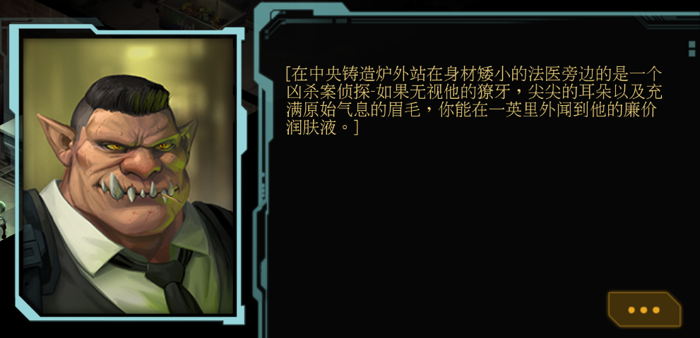
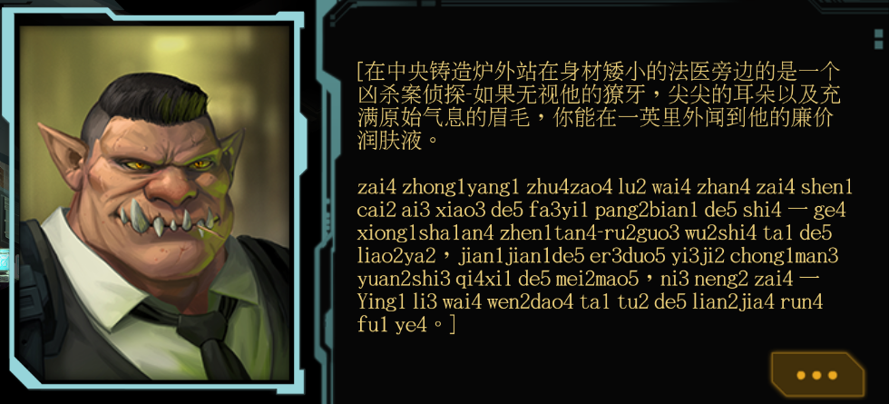

# Shadowrun Returns Preprocessor
A tool for manipulating the Chinese translations of *Shadowrun Returns* for language-learning purposes. It converts the original Chinese `.po` file into a `.mo` file that contains both the Chinese text and its pinyin, along with a series of cleanup passes for punctuation, templates, and proper names.




## What the script does

- Reads `materials/translations/zh_deadmanswitch_original.po`.
- Uses `pinyiniser` (and its dictionary plus special-token handling) to:
  - Extract Chinese text segments.
  - Generate pinyin for those segments, respecting game markup (`{{GM}}`, `{{/CC}}`, etc.) and template variables (`$(l.name)`, `$+(l.honorific)`, etc.).
- Joins the Chinese segments with zero‑width spaces and appends a pinyin block separated by a blank line.
- Applies a large set of replacement rules:
  - **Punctuation fixes** (e.g., stray spaces around `。`, `，`, `：`, `！`, quotes, ellipses, brackets).
  - **Template token fixes** (re-squashing spaced-out `$(...)` variables).
  - **Markup tag fixes** (re-squashing spaced-out `{{...}}` tags).
  - **Proper name fixes** (joining multi-syllable pinyin for recurring character and place names into single tokens, e.g. `kai3 yao1 di1` → `Kai3yao1di1`).
  - **Miscellaneous fixes** (email addresses, model numbers, numbering, etc.).
- Writes out a compiled `.mo` file named `zh_deadmanswitch.mo` in the project root.

## Requirements

- Python 3
- `polib`
- `pinyiniser`

You can install the Python dependencies with:

```bash
pip install -r requirements.txt
```

## How to run

From the project root:

```bash
python main.py
```

After it finishes, you should have a `zh_deadmanswitch.mo` file that can be used by the game (or further processed by other gettext tooling).

## Using gettext tools directly

- **PO → MO**: compile a `.po` file into a `.mo` file:

```bash
msgfmt input.po -o output.mo
```

- **MO → PO**: decompile a `.mo` file back into a `.po` file:

```bash
msgunfmt input.mo -o output.po
```

For more details, see the **GNU gettext manual**: `https://www.gnu.org/software/gettext/manual/gettext.html`

## Notes

If you notice Chinese characters in the pinyin line, it is likely because of
template tokens like `$+(l.honorific)`, `$(l.sir)`, `$(l.Sir)`, `$(l.sir)`, etc.
and cannot be handled by this library, as its possible that your character
will have a different gender in game.